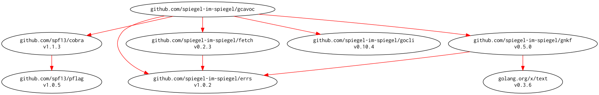

# [gcavoc] -- Common Agricaulturel Vocabulary API Client by Golang

[](https://github.com/spiegel-im-spiegel/gcavoc/actions)
[](https://github.com/spiegel-im-spiegel/gcavoc/actions)
[](https://raw.githubusercontent.com/spiegel-im-spiegel/gcavoc/master/LICENSE)
[](https://github.com/spiegel-im-spiegel/gcavoc/releases/latest)

This package is required Go 1.16 or later.

[gcavoc] は「[共通農業語彙（Common Agricaulturel VOcabulary; CAVOC）](http://cavoc.org/)」が提供する Web API を使って「[農作物語彙体系（Crop VOcabulary; CVO）](http://cavoc.org/cvo.php)」情報を取得するコマンドライン・ツールである。

## ビルドとインストール

```
$ go install github.com/spiegel-im-spiegel/gcavoc@latest
```

## 実行バイナリの提供

[最新リリースページ](https://github.com/spiegel-im-spiegel/gcavoc/releases/latest)からビルド済み実行バイナリをダウンロードできる。各種プラットフォーム用のバイナリを用意している。

## 簡単な使い方

[gcavoc] は以下のサブコマンドと組み合わせて使う。

```
$ gcavoc -h
Common Agricaulturel Vocabulary API client.

Usage:
  gcavoc [flags]
  gcavoc [command]

Available Commands:
  group-name      Output group name from applied crop name
  help            Help about any command
  multi-lingual   Output multi lingual crop names from CVO synonym
  ncbi            Output NCBI ID from applied crop name
  scientific-name Output scientific name from CVO synonym
  standard-term   Output standard term from CVO synonym
  version         print the version number
  wikipedia       Output Wikipedia URL from applied crop name

Flags:
      --debug   for debug
  -h, --help    help for gcavoc

Use "gcavoc [command] --help" for more information about a command.
```

以降から，各サブコマンドの簡単な使い方を説明する。

### 農作物標準語彙への変換

```
$ gcavoc standard-term -h
Output standard term from CVO synonym.

Usage:
  gcavoc standard-term [flags] <CVO synonym>

Aliases:
  standard-term, standard, std

Flags:
  -h, --help       help for standard-term
  -k, --katakana   convert search term to katakana

Global Flags:
      --debug   for debug
```

CVO の同義語データから作物の標準名を取得する。結果は JSON 形式で標準出力に出力される。

```
$ gcavoc std せろり
{"term":"セロリ"}
```

API では一部のひらがなを上手く認識しないようなので， `-k` オプションを使ってコマンド内部でカタカナに変換して問い合わせできるようにした。

```
$ gcavoc std せろりー
{"term":""}

$ gcavoc std -k せろりー
{"term":"セロリ"}
```

### 作物名から学名・英名を取得する

```
$ gcavoc scientific-name -h
Output scientific name from CVO synonym.

Usage:
  gcavoc scientific-name [flags] <CVO synonym>

Aliases:
  scientific-name, scientific, sci

Flags:
  -h, --help       help for scientific-name
  -k, --katakana   convert search term to katakana

Global Flags:
      --debug   for debug
```

CVO の同義語データから作物の学名および英語名を取得する。結果は JSON 形式で標準出力に出力される。 `-k` オプションも使える。

```
$ gcavoc sci -k せろりー
{"scientific_name":"Apium graveolens (var. dulce)","en_name":"Celery"}
```

### 適用農作物の科名を取得

```
$ gcavoc group-name -h
Output scientific name and group name from applied crop name.

Usage:
  gcavoc group-name [flags] <applied crop name>

Aliases:
  group-name, group, grp, gr

Flags:
  -h, --help       help for group-name
  -k, --katakana   convert search term to katakana
  -s, --synonym    input parameter as a CVO synonym

Global Flags:
      --debug   for debug
```

適用農作物名から作物の科名および学名を取得する。結果は JSON 形式で標準出力に出力される。

```
$ gcavoc gr セロリ
{"scientific_name":"Apium graveolens (var. rapaceum)","group":"セリ科"}
```

`-s` オプションを使って同義語から作物の科名および学名を取得することもできる。 `-k` オプションも使える。

```
$ gcavoc gr -s -k せろりー
{"scientific_name":"Apium graveolens (var. rapaceum)","group":"セリ科"}
```

### 適用農作物の NCBI ID を取得

```
$ gcavoc ncbi -h
Output scientific name and NCBI ID from applied crop name.

Usage:
  gcavoc ncbi [flags] <applied crop name>

Aliases:
  ncbi, n

Flags:
  -h, --help       help for ncbi
  -k, --katakana   convert search term to katakana
  -s, --synonym    input parameter as a CVO synonym

Global Flags:
      --debug   for debug
```

適用農作物名から作物の NCBI ID および学名を取得する。結果は JSON 形式で標準出力に出力される。

```
$ gcavoc n セロリ
{"NCBI_id":"278110","scientific_name":"Apium graveolens (var. rapaceum)"}
```

`-s` オプションを使って同義語から作物の NCBI ID および学名を取得することもできる。 `-k` オプションも使える。

```
$ gcavoc n -s -k セロリ
{"NCBI_id":"278110","scientific_name":"Apium graveolens (var. rapaceum)"}
```

### 適用農作物の Wikipedia URL を取得

```
$ gcavoc wikipedia -h
Output Wikipedia URL from applied crop name.

Usage:
  gcavoc wikipedia [flags] <applied crop name>

Aliases:
  wikipedia, w

Flags:
  -h, --help       help for wikipedia
  -k, --katakana   convert search term to katakana
      --raw        output raw data (JSON format)
  -s, --synonym    input parameter as a CVO synonym

Global Flags:
      --debug   for debug
```

適用農作物名から該当する Wikipedia URL を取得する。結果は標準出力に出力される。該当するページがない場合は空行を返す。

```
$ gcavoc w セロリ
https://ja.wikipedia.org/wiki/%E3%82%BB%E3%83%AB%E3%83%AA%E3%82%A2%E3%83%83%E3%82%AF
```

`--raw` オプションを付けると Web API が返した値を JSON 形式のまま出力する。

```
$ gcavoc sci w --raw セロリ
{"WIKIPEDIA_url":"https://ja.wikipedia.org/wiki/セルリアック"}
```

Web API が返す URL は日本語部分が正しく符号化されていないため注意が必要である。

`-s` オプションを使って同義語から作物の Wikipedia URL を取得することもできる。 `-k` オプションも使える。

```
$ gcavoc w -s -k せろりー
https://ja.wikipedia.org/wiki/%E3%82%BB%E3%83%AB%E3%83%AA%E3%82%A2%E3%83%83%E3%82%AF
```

### 多言語表記の取得

```
$ gcavoc multi-lingual -h
Output multi lingual crop names from CVO synonym.

Usage:
  gcavoc multi-lingual [flags] <CVO synonym>

Aliases:
  multi-lingual, multi, m

Flags:
  -h, --help       help for multi-lingual
  -k, --katakana   convert search term to katakana

Global Flags:
      --debug   for debug
```

CVO の同義語データから作物の多言語表記を取得する。結果は JSON 形式で標準出力に出力される。 `-k` オプションも使える。

```
$ gcavoc m -k せろりー
{"ja":"セロリ","en":"Celery","zh":"西洋芹","ko":"셀러리"}
```

## 依存モジュールの関連図

[](./dependency.png)


[gcavoc]: https://github.com/spiegel-im-spiegel/gcavoc "spiegel-im-spiegel/gcavoc: Common Agricaulturel Vocabulary API Client by Golang"
